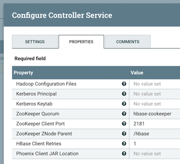

# BigData Fun
This is the respository associated with my article, [Big Data, Little Cloud](https://karlstoney.com/2017/02/11/really-bigdata-really-small-cloud/).

In summary, I wanted to learn more about big data, and some of the key tools in the market.  As a result, I decided to create an all in one docker environment where I can test out all the bits.

The key components currently implemented are:

- [HDFS](http://hortonworks.com/apache/hdfs) - Distributed file system, including two data nodes
- [HBase](http://hortonworks.com/apache/hbase) - Non-relational, distributed database similar to Google BigTable
- [Hue](http://gethue.com) - Web interface for analyzing data
- [NiFi](https://nifi.apache.org) - A system to process and distribute data
- [HBase Indexer](http://ngdata.github.io/hbase-indexer/) - HBase Indexer allows you to easily and quickly index HBase rows into Solr. 
- [Solr](http://lucene.apache.org/solr/) - Search platform based on Lucene
- [Banana](https://github.com/lucidworks/banana) - A kibana port for visualisation of Solr data
- [Flume](https://flume.apache.org/) - A headless way to process and distribute data

The following components will be coming soon:

- [Spark](http://spark.apache.org/) - Data processing engine

## Getting started

### Requirements
As most of these components run inside a JVM, as you've probably guessed - this fully distributed setup is rather resource intensive.  If you're on Linux, with an alright amount of RAM, you'll be fine.  However if you're running docker through Virtualisation like HyperV or Qemu2 (mac), you need may need to tweak things a little.  

**IMPORTANT** If you're on Mac, ensure you have adequate RAM assigned to the docker daemon (Preferences -> Advanced).  I personally have this set to 8gb, on a 16gb Mac and it runs [sweet as a nut](http://www.urbandictionary.com/define.php?term=sweet%20as%20a%20nut).

**IMPORTANT**: Before you do anything, you need to build the base images.  Please do `docker-compose -f compose.build.yml build`

### Key URLs
Once you've used one of the start up options below, these are your key URLs:

- HDFS NameNode UI: [http://127.0.0.1:17000](http://127.0.0.1:17000)
- HBase Master UI: [http://127.0.0.1:17001](http://127.0.0.1:17001)
- HBase Region UI: [http://127.0.0.1:17002](http://127.0.0.1:17002)
- ZooKeeper API: [http://127.0.0.1:17003](http://127.0.0.1:17003)
- Thrift UI: [http://127.0.0.1:17004](http://127.0.0.1:17004)
- HBase Rest API: [http://127.0.0.1:17005](http://127.0.0.1:17005)
- Hue UI: [http://127.0.0.1:17006](http://127.0.0.1:17006)
- NiFi UI: [http://127.0.0.1:17007](http://127.0.0.1:17007)
- Solr UI: [http://127.0.0.1:17008](http://127.0.0.1:17008)
- Banana UI: [http://127.0.0.1:17009](http://127.0.0.1:17009/src/index.html#/dashboard)

### Startup Options

#### Starting everything
If you just want to start everything, do `docker-compose up -d`.  I believe I've mapped the dependencies correctly in the base docker-compose.yml, so give it a minute and everything should start up. 

#### Starting individual components
I've tried to break the docker-compose file down into sub sections:

 - HDFS: `docker-compose up namenode datanode1 datanode2 resourcemanager`
 - HBase: `docker-compose up zookeeper regionserver master thrift rest`, requires HDFS
 - Solr/Lily/Banana: `docker-compose up solr banana lily`, requires HBase

Then you've got the other tools too, so start them by name: `hue`, `nifi`.

#### Starting the user import demo (recommended) 
I am working on a complete end to end demo however, so if you prefer, just run `./demo.sh`.  The idea of this demo is to read in random user data from a sample API, import that into HBase, have the indexer then send that over to Solr so we can query it in Banana.

## The components in detail

### Hadoop HDFS (2.7.3)

 - namenode
 - datanode1
 - datanode2
 - resourcemanager

This is a HDFS cluster running two data nodes, and a YARN resource manager.


### HBase (1.3.0)

 - zookeeper
 - master
 - regionserver

This setup is designed to replicate a fully distributed setup, subsequently we're running in distributed mode and running separate instances (containers) of the following:

The HBase container can be run in standalone mode too, if you want - which will result in less JVMs, but a less production like environment.  To run HBase in standalone mode, run the HBase container with `HBASE_MANAGES_ZK=true`, `HBASE_CONF_DISTRIBUTED=false` and `HBASE_CONF_QUORUM=hbase-master`.

You can read more about the modes [here](http://hbase.apache.org/0.94/book/standalone_dist.html).

If you want to visulaise the Zookeeper data, take a look at [zk-web](https://github.com/qiuxiafei/zk-web).  It certainly helped me debugging.


#### Rest/Thrift

 - thrift
 - rest

The rest & thrift interfaces sit on top of the cluster, you can stop them if you don't need them.


### Hue (latest)
 
 - [Hue](https://github.com/cloudera/hue) 

When you first use Hue, it does a health check and will tell you that a bunch of stuff isn't configured correctly, that's fine as I don't plan to build the whole Cloudera stack, just 'next next next' thought it and use the components that matter, like the [HBase Browser](http://127.0.0.1:8888/hbase/#hbase).

### NiFi (1.1.1)

 - nifi

Ahhh NiFi.  Think of it as the more feature complete, graphical version of Flume.  It really does make getting data into HBase rather simple.  However, as it's generally the last to start - if your machine is resource constrained then NiFi will just randomly not boot.  Give docker more ram, buy more ram, just ram.

To get started, I reccomend using some templates from [Here](https://github.com/hortonworks-gallery/nifi-templates/tree/master/templates), in particular [Fun With HBase](https://raw.githubusercontent.com/hortonworks-gallery/nifi-templates/master/templates/Fun_with_HBase.xml) which will get you importing some random user data into HBase in a matter of minutes.

The only think you actually need to configure is the controller service `HBase_1_1_2_ClientService`.  Basically you need to point it at ZooKeeper so it can discover your HBase nodes.



Oh, and create the table in HBase:

```
$ docker-compose exec master hbase shell
HBase Shell; enter 'help<RETURN>' for list of supported commands.
Type "exit<RETURN>" to leave the HBase Shell
Version 1.3.0, re359c76e8d9fd0d67396456f92bcbad9ecd7a710, Tue Jan  3 05:31:38 MSK 2017

hbase(main):001:0> create 'Users', 'cf'
0 row(s) in 5.4940 seconds

=> Hbase::Table - Users
```

After you've done that - start the process flows in NiFi and you'll see data being imported into HBase.  Easy as that!


### Banana (1.16.12)

 - banana

Banana is a Kibana port for Solr.  It's used to visulaise the data we're indexing.  I haven't done much with it yet other than semi get it running.  

### HBase Indexer (Lily)

 - lily

HBase Indexer allows you to easily and quickly index HBase rows into Solr.  It links to the HBase replication agent, whenever data is modified in HBase those events are mutated and sent over to the Solr instance.

### Solr (6.4.1)

 - solr

Search/Index platform based on Lucene.  If you're familiar with the ELK stack, this is the ElasticSearch component.

### Flume (1.7.0)
  
 - flume

I wanted a GUI-less way to strema data into HBase or HDFS too.  That's what this container does.  It includes the java classes for HBase and HDFS too so those sinks will work.  By default, docker-compose will mount `./data/flume`, and any files you place in there will be 'flumed' into a HBase table called `flume_sink`, with the column family `cf`.  That's all config driven though so edit `./config/flume/flume-conf.properties` to change that behaviour.  
  
In order for the HBase aspect to work, you need to create the table first, that's easiest via the hbase shell.

```
$ docker-compose exec master hbase shell
HBase Shell; enter 'help<RETURN>' for list of supported commands.
Type "exit<RETURN>" to leave the HBase Shell
Version 1.3.0, re359c76e8d9fd0d67396456f92bcbad9ecd7a710, Tue Jan  3 05:31:38 MSK 2017

hbase(main):001:0> create 'flume_sink', 'cf'
0 row(s) in 2.5370 seconds

=> Hbase::Table - flume_sink
```

If you've started flume before creating this table, you'll be seeing errors like this:
```
org.apache.flume.FlumeException: Error getting column family from HBase.Please verify that the table flume_sink and Column Family, cf exists in HBase, and the current user has permissions to access that table.
```

Simply do a `docker-compose restart flume` and it'll sort itself out.


## Credits
The HDFS work has been tackled beautifully by [https://github.com/big-data-europe/docker-hadoop](https://github.com/big-data-europe/docker-hadoop), so I'm using a lot of what they did for the hadoop namenodes and datanodes.

## Tested on...
```
$ docker version
Client:
 Version:      1.13.1
 API version:  1.26
 Go version:   go1.7.5
 Git commit:   092cba3
 Built:        Wed Feb  8 08:47:51 2017
 OS/Arch:      darwin/amd64

Server:
 Version:      1.13.1
 API version:  1.26 (minimum version 1.12)
 Go version:   go1.7.5
 Git commit:   092cba3
 Built:        Wed Feb  8 08:47:51 2017
 OS/Arch:      linux/amd64
 Experimental: true


$ docker-compose version
docker-compose version 1.11.1, build 7c5d5e4
docker-py version: 2.0.2
CPython version: 2.7.12
OpenSSL version: OpenSSL 1.0.2j  26 Sep 2016

```
